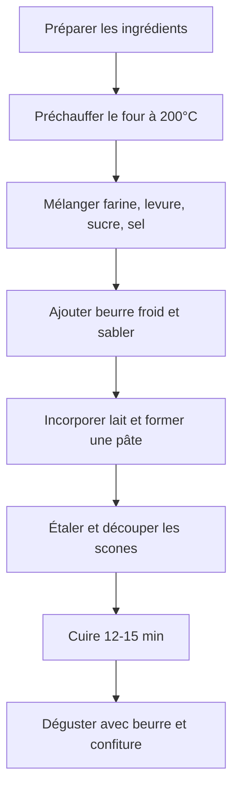

```mermaid
graph TD
    A[Préparer les ingrédients] --> B[Préchauffer le four à 200°C]
    B --> C[Mélanger farine, levure, sucre, sel]
    C --> D[Ajouter beurre froid et sabler]
    D --> E[Incorporer lait et former une pâte]
    E --> F[Étaler et découper les scones]
    F --> G[Cuire 12-15 min]
    G --> H[Déguster avec beurre et confiture]
```
